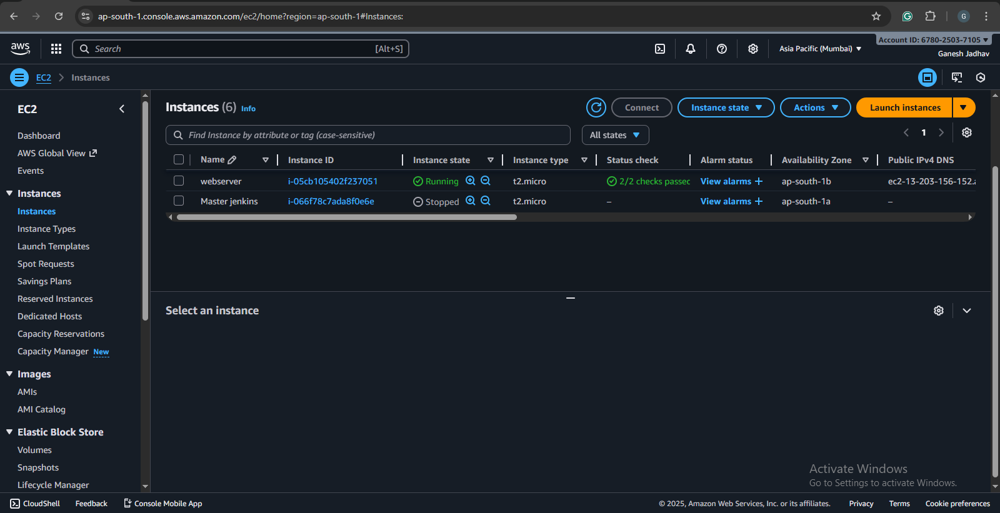
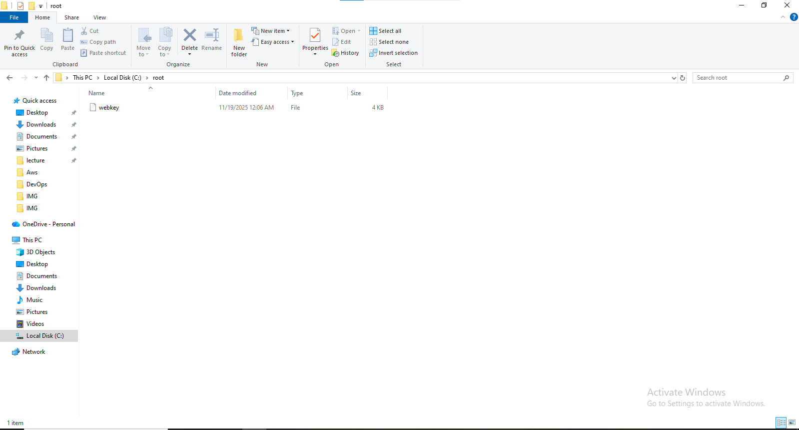
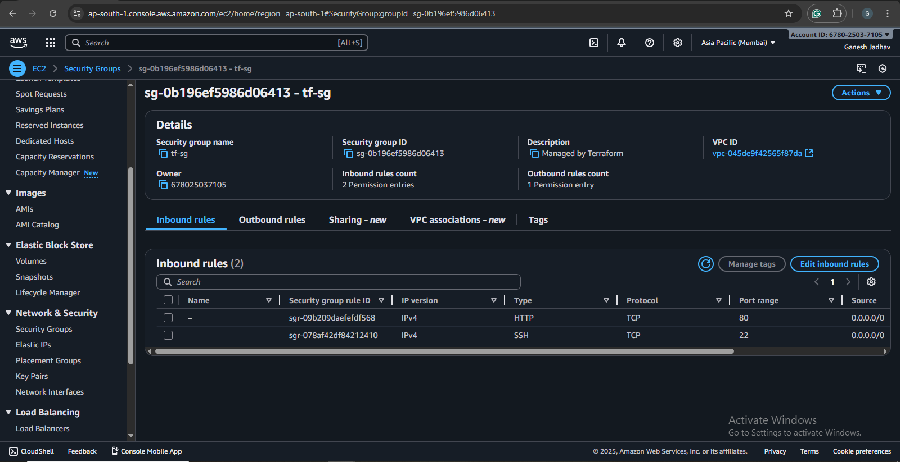
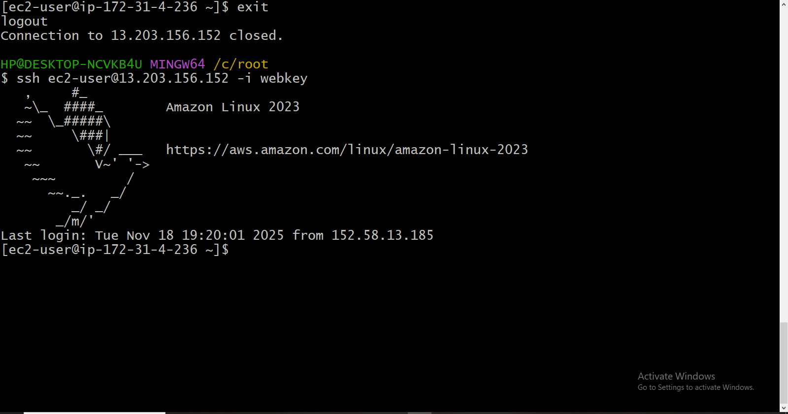

# Terraform – EC2 Instance with Key Pair & Security Group

This project automates the creation of an EC2 instance on AWS using Terraform.
It includes:

Automatically generated RSA key pair

Security Group with SSH + HTTP

EC2 instance (t2.micro)

Local private key storage

## 🚀 What this Terraform setup does

Generates a **4096-bit RSA** private key

Saves the private key to ***/root/webkey***

Creates an AWS key pair using the public key

Creates a security group (SSH + HTTP)

Launches an EC2 instance using that key & SG

## 📂 Files
```
main.tf
```
**Contains:**

- tls_private_key
- local_file
- aws_key_pair
- aws_security_group
- aws_instance

## 🧩 Example Terraform Code
```
resource "tls_private_key" "rsa" {
  algorithm = "RSA"
  rsa_bits  = 4096
}

resource "aws_key_pair" "web-key" {
  key_name   = "web-key"
  public_key = tls_private_key.rsa.public_key_openssh
}

resource "local_file" "web-key" {
  content  = tls_private_key.rsa.private_key_pem
  filename = "/root/webkey"
}

resource "aws_security_group" "tf-sg" {
  name = "tf-sg"

  ingress {
    description = "ssh"
    from_port   = 22
    to_port     = 22
    protocol    = "tcp"
    cidr_blocks = ["0.0.0.0/0"]
  }

  ingress {
    description = "http"
    from_port   = 80
    to_port     = 80
    protocol    = "tcp"
    cidr_blocks = ["0.0.0.0/0"]
  }

  egress {
    description = "all"
    from_port   = 0
    to_port     = 0
    protocol    = -1
    cidr_blocks = ["0.0.0.0/0"]
  }
}

resource "aws_instance" "webserver" {
  ami                    = "ami-03695d52f0d883f65"
  instance_type          = "t2.micro"
  vpc_security_group_ids = [aws_security_group.tf-sg.id]
  key_name               = "web-key"

  tags = {
    Name = "webserver"
  }
}
```

## 🛠️ How to Use

1️⃣ **Initialize**
```
terraform init
```

2️⃣ **Validate** 
``` 
terraform validate
```
3️⃣ **Apply**
```  
terraform apply -auto-approve
```
4️⃣ **SSH into EC2**

**Private key saved at:**
```
/root/webkey
```
**SSH command:**
```
chmod 600 webkey  
ssh -i webkey ec2-user@<public-ip>
```

## 📸 Screenshots

**EC2 Instance Dashboard**  


**Key Pair**  


**Security Group**  


**SSH Terminal**  


## 📚 Terraform Resources (Official Docs)

Here are official documentation links for the resources used in this project:

**aws_instance**  
https://registry.terraform.io/providers/hashicorp/aws/latest/docs/resources/instance

**aws_security_group**  
https://registry.terraform.io/providers/hashicorp/aws/latest/docs/resources/security_group

**aws_key_pair**  
https://registry.terraform.io/providers/hashicorp/aws/latest/docs/resources/key_pair

**tls_private_key**  
https://registry.terraform.io/providers/hashicorp/tls/latest/docs/resources/private_key

**local_file**  
https://registry.terraform.io/providers/hashicorp/local/latest/docs/resources/file

---

## 🎓 What We Learned

- Creating RSA key pairs in Terraform
- Saving private keys locally
- Creating AWS Key Pairs
- Configuring Security Groups
- Deploying EC2 with Terraform
- SSH connection to EC2
- Full infrastructure automation

---

## 👨‍💻 Author

**Ganesh Jadhav**

GitHub: https://github.com/iam-ganeshjadhav  
Email: jadhavg9370@gmail.com


